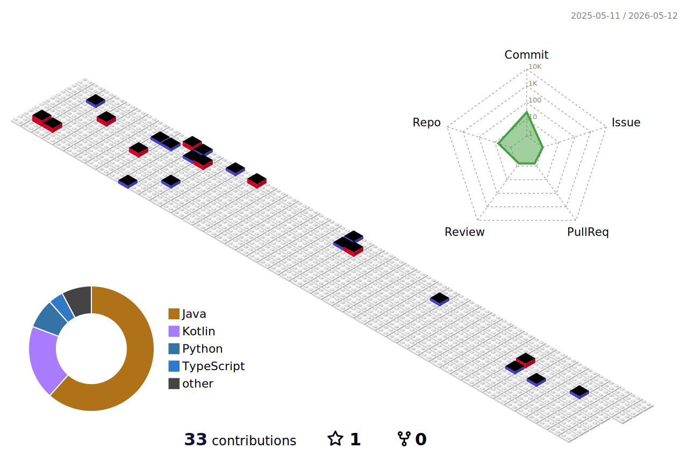

<!-- Header with animated gradient text effect via image -->

 

<!-- Intro -->
<h2>
  
  &nbsp;안녕하세요, 최정훈입니다
</h2>

  <b>6년차 백엔드 개발자</b>로, 읽기 쉽고 유지보수하기 좋은 코드를 지향합니다. 
  매일 한 줄이라도 커밋하는 것이 저의 루틴이자 철학입니다. 🔥

 

---

<!-- Tech Stack -->
<h3>🛠&nbsp; Tech Stack</h3>

  
  
  
  

  
  
  

 

---

<!-- Stats -->
<h3>📊&nbsp; GitHub Stats</h3>

  
  &nbsp;
  

 

---

<!-- Streak -->
<h3>🔥&nbsp; 꾸준한 커밋이야말로 개발자의 덕목</h3>

  

---

<!-- 3D Contribution -->
<h3>🧱&nbsp; 여기선 잔디가 아니라 레고</h3>

 

---

<!-- Footer -->

