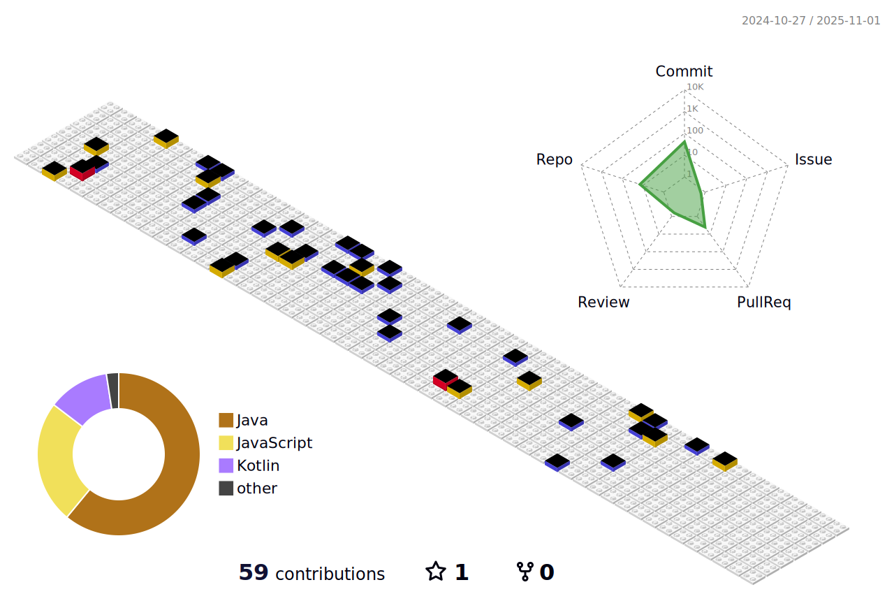

<h3 align="center" >반갑습니다 😁</h1>

현재 3년차 개발자로 일하고 있으며 매일 커밋하기 위해 노력합니다.

  

<h3 align="center" >🛠 Tech </h1>

 
 

  

 

<h3 align="center" >🖊️ 블로그 </h3>

 

<h3 align="center" >📈 Status </h1>

